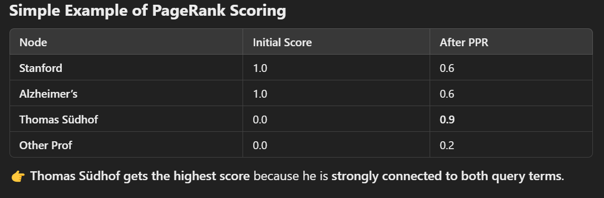

+++
date = '2025-03-12T20:41:21+05:30'
draft = false
title = "About HippoRAG"
categories = ['Tech']
tags = ["ai", "history", "deeplearning"]
+++

These are some LLM-assisted exploration notes from the paper [HippoRAG: Neurobiologically Inspired
Long-Term Memory for Large Language Models](https://arxiv.org/pdf/2405.14831)


## The Multi-Hop Problem in RAGs

The idea of "hops" are important in RAG.

Consider this example.

Question 1: 

*"Who wrote Hamlet?"*

→ The answer (Shakespeare) is in one document.*

Question 2:

*"Which university did the president of OpenAI attend?"*

- Step 1: Retrieve information on who the president of OpenAI is (e.g., Greg Brockman).
- Step 2: Retrieve information on which university Greg Brockman attended (e.g., MIT).

## How HippoRAG Achieves a Single-Step Multi-Hop Retrieval

Traditional RAG solutions, such as IRCoT (Iterative Retrieval Chain-of-Thought) depend on *iterative retrieval* - kind of like looking up docs in a loop.

With HippoRAG, two mechanisms are combined to compress these multiple hops into one:

-   **Building a knowledge graph (KG)** where concepts and relationships are indexed.
-   **Using Personalized PageRank (PPR)** to retrieve relevant paths across multiple documents in one query.

The benefits of the above combination makes HippoRAG:

- **Faster** (avoids iterative retrieval)
- **More accurate** (find connections that isolated retrieval steps miss)
- **Cheaper** (reduce API calls and computation)

## How HippoRAG Builds Its Knowledge Graph (KG)

HippoRAG constructs a **schemaless knowledge graph** from a text corpus by leveraging **large language models (LLMs)** for **Open Information Extraction (OpenIE)** and retrieval encoders for linking entities. This process enables **multi-hop reasoning in a single retrieval step**.

#### **1\. Offline Indexing (Building the Graph)**

This step is analogous to how the **human neocortex encodes memory**.

✅ **Extract Knowledge Graph Triples**

-   Uses an **instruction-tuned LLM** (e.g., GPT-3.5) to **extract subject-predicate-object triples** from text.
    -   Example:  
        **Input Passage:** "Steve Jobs co-founded Apple in 1976."  
        **Extracted Triples:**
        -   `(Steve Jobs, co-founded, Apple)`
        -   `(Apple, founded_in, 1976)`

✅ **Create Graph Nodes & Edges**

-   **Nodes** = extracted **entities (noun phrases)** (e.g., _Steve Jobs, Apple_).
-   **Edges** = relationships between entities (e.g., _co-founded_).

✅ **Synonymy Linking (Parahippocampal Processing)**

-   Uses **retrieval encoders** (e.g., **Contriever, ColBERTv2**) to **identify similar entities** (e.g., "USA" = "United States").
-   Creates **extra edges** to connect synonyms, improving retrieval robustness.

✅ **Store the Graph**

-   The final **knowledge graph** consists of:
    -   **Nodes (Entities)**
    -   **Edges (Relations & Synonyms)**
    -   **Passage Mapping** (Each node is linked to the original text passage for retrieval)

### **2\. Online Retrieval (Querying the Graph)**

This step mimics the **hippocampus retrieving memories**.

✅ **Extract Query Named Entities**

-   The LLM identifies **key entities** in the query.
-   Example: _"Which Stanford professor works on Alzheimer's?"_
    -   Query Entities: `{Stanford, Alzheimer’s}`

✅ **Find Related Nodes in the Knowledge Graph**

-   Uses **retrieval encoders** to find **graph nodes most similar** to the query entities.
-   Example: The query `{Stanford, Alzheimer’s}` matches the node `{Thomas Südhof}` in the KG.

✅ **Personalized PageRank (PPR) for Multi-Hop Retrieval**

-   Runs **Personalized PageRank (PPR)** on the graph using query nodes as **starting points**.
-   Spreads probability over **connected nodes**, enabling **multi-hop reasoning**.
-   Example:
    -   `{Stanford}` → `{Thomas Südhof}`
    -   `{Alzheimer’s}` → `{Thomas Südhof}`
    -   **Final Retrieval:** Thomas Südhof is a Stanford professor working on Alzheimer’s.

✅ **Retrieve & Rank Passages**

-   The **most relevant passages** are selected based on PPR scores.

### **How HippoRAG Uses PageRank to Order Results**

1.  **Convert Text to a Graph**
    
    -   Extract **entities** (nodes) and **relationships** (edges).
    -   Example:
    ```
    (Stanford, employs, Thomas Südhof)  
    (Thomas Südhof, researches, Alzheimer’s)
    ```
2.  **Find Relevant Nodes**
    
    -   If the query is: _"Which Stanford professor studies Alzheimer's?"_
    -   The query **matches** `{Stanford, Alzheimer’s}` in the graph.
3.  **Run Personalized PageRank (PPR)**
    
    -   **Give high starting scores to query nodes** (`Stanford` and `Alzheimer’s`).
    -   **Spread scores to connected nodes** (e.g., `Thomas Südhof` gets a high score).
4.  **Rank Passages by PageRank Score**
    
    -   Passages mentioning `Thomas Südhof` get **top rank**.
    -   Less relevant passages rank **lower**.



### **Why This Works**

-   **Finds indirect connections** (multi-hop retrieval).
-   **Ranks based on real-world relevance** rather than keyword matching.
-   **Fast, since it's done in one step.**


