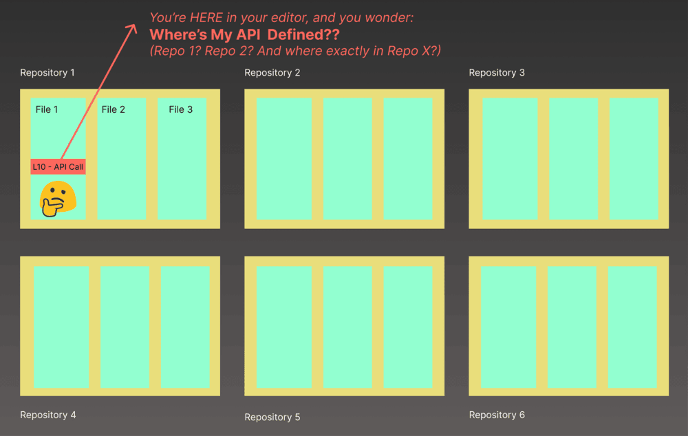
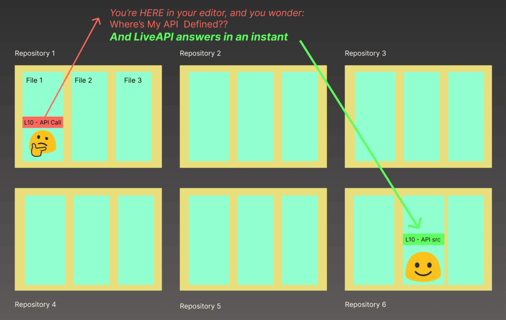

+++
date = '2025-03-05T23:43:58+05:30'
draft = false
title = 'A Simple Tool To Quickly Find API Entry Points Across All Your Repositories'
Categories = ['Tech']
tags = ['api', 'liveapi', 'productivity']
+++

Imagine you’re deep in a coding session, cruising through your repository, when bam—you hit an API reference that stops you cold. 

You’ve got no idea where it lives, and now you’re stuck.

Sound familiar? That’s the pain I want to talk about today, and how a tool I’ve been tinkering with—LiveAPI—tackles it head-on. 

This isn’t just about saving time; it’s about keeping your flow intact and your sanity in check. 

Let’s break it down.

## The Problem

Picture this: you’re in **repository R1**, poking around in **file F1**, line **L1**, and you spot a call to some API route—like `/users/{id}/profile`. Cool, but where does it come from? Is it in this repo? Another one? You’ve got a hunch it’s *somewhere* in your sprawling codebase, but pinning it down feels like searching for a needle in a haystack. 

Here’s what usually happens:

- You grep through the current repo. Nothing.
- You vaguely recall seeing it in **repository R2**, maybe in **file F2**, around **line L2**—but you’re not sure.
- You dig through docs (if they exist), Slack threads, or—worst case—ping a colleague who’s just as busy as you.

This isn’t just annoying; it’s a **flow killer**. 

You’re yanked out of your groove, wasting minutes (or hours) chasing down a single endpoint. 

Sometimes you figure it out, sometimes you don’t, but either way, it’s a disruption. 

Multiply that by dozens of APIs across multiple repos, and you’ve got a productivity nightmare.

| **Pain Point**            | **Impact**                          |
|---------------------------|-------------------------------------|
| Unclear API location      | Breaks focus, slows momentum       |
| Vague recollection        | Extra mental load to recall        |
| Manual hunting            | Time sink, inconsistent results   |
| Bothering colleagues      | Delays, team friction             |

## How LiveAPI Solves the Problem

Enter **LiveAPI**, a tool built to cut through this mess. 

It’s not some lightweight script—it’s an **infrastructure-scale solution** designed to map out all your REST backend APIs across every repository you throw at it. 

Whether you’ve got dozens, hundreds, or even thousands of repos, LiveAPI’s got your back.

Here’s the magic:

- **Broad coverage**: We support the **top 15 languages** and **60+ frameworks**. Python with Flask? Java with Spring? Node.js with Express? You name it, we handle it.
- **Real-time tracking**: LiveAPI watches your repos for changes. If an endpoint gets updated, added, or axed, it stays in sync—no stale data here.
- **Fast search**: Need to find `/users/{id}/profile`? Type it in, and LiveAPI spits out the exact endpoint, parameters, and even a description if you’ve got one documented.
- **Source code links**: One click, and you’re at the exact file and line—like jumping from **R1, F1, L1** to **R2, F2, L2** without breaking a sweat.

Think of it like a GPS for your APIs. 

Instead of fumbling through repos or bugging your teammate, you get a clean, instant path to the source.

Here’s a quick example of what you might see:

| **Search Query**      | **Result**                          | **Source**            |
|-----------------------|-------------------------------------|-----------------------|
| `/users/{id}/profile` | GET endpoint, returns user profile | `R2/F2#L2`           |
| `POST /auth/login`    | Authenticates user, returns token  | `R3/F5#L12`          |

This is one of the visuals I’ve got—it’s a crisp look at how LiveAPI ties an endpoint to its origin in one glance.

## Roadmap to Improve Developer Experience

LiveAPI’s already pretty handy, but we’re not stopping there. 

Here’s what’s cooking to make it even better:

- **Intelligent chat**: Search is great, but what if you could *talk* to your API map? We’re exploring a chat interface where you can ask things like, “Which endpoints handle user auth?” and get a conversational breakdown. It’s about building on your infrastructure, not just finding it.
- **IDE extensions**: Imagine right-clicking an API call in your editor and pulling up its details without leaving your context. We’re working on plugins for VS Code, IntelliJ, and others to make that a reality.
- **Accuracy & reliability**: We’re testing and tweaking every day. The goal? Make sure LiveAPI catches every endpoint, every change, every time—no misses, no lag.

The focus is on keeping it seamless. 

You shouldn’t have to think about the tool; it should just work when you need it.

## How LiveAPI Solves the Entry Point Problem (Reiterate)

Let’s circle back to that core headache: finding where your APIs live. 

LiveAPI doesn’t just slap a band-aid on it—it **rewrites the game**. 

By indexing every REST endpoint across all your repos, it turns a scattered hunt into a single, confident click. 

Say you’re staring at that `/users/{id}/profile` call again. With LiveAPI:

1. Punch it into the search.
2. See the endpoint, its params, and a link to **R2, F2, L2**.
3. Jump straight there—no grep, no guesswork, no Slack pings.

This second image nails it—showing the leap from query to code in action.

It’s not just about speed (though it’s fast). 

It’s about **staying in the zone**. 

No more context-switching or mental juggling. 

Whether you’re debugging, onboarding, or just curious, LiveAPI hands you the keys to your API kingdom.

## Wrapping Up

If you’re tired of playing API hide-and-seek across your repositories, give LiveAPI a spin. 

It’s built for developers like us—people who want answers fast and flow uninterrupted. 

Check out the [LiveAPI site](https://hexmos.com/liveapi) for more, or drop a comment if you’ve got ideas to make it even better. 

What’s your biggest API related horror story? I’d love to hear it.