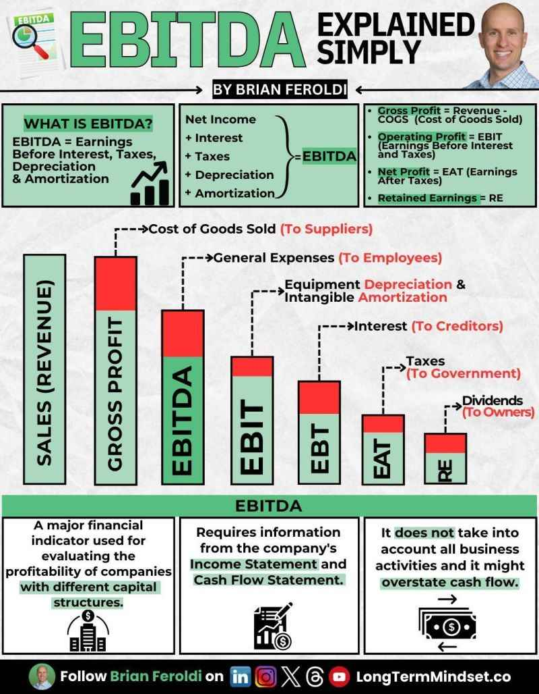
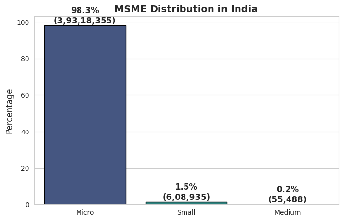
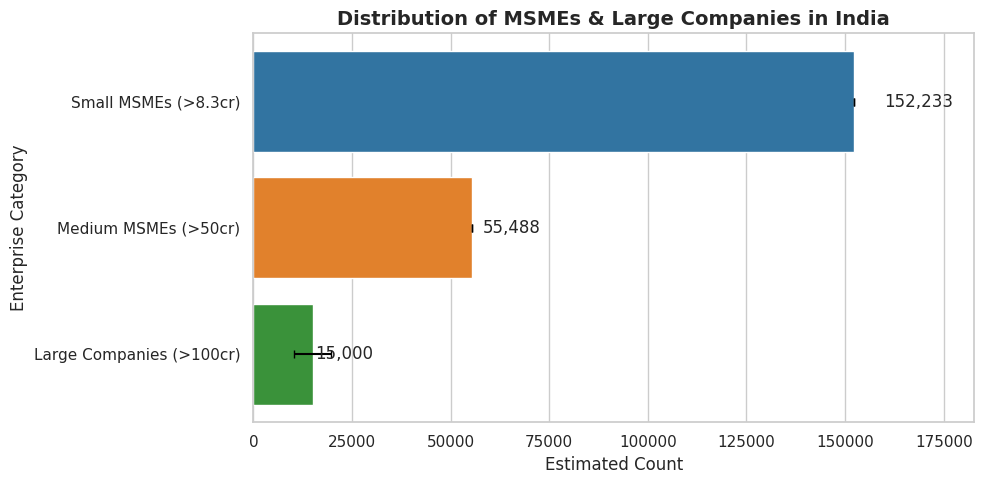
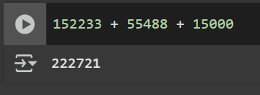

+++
date = '2025-02-27T16:35:55+05:30'
draft = false
title = 'How many Indian Companies Generate 1M+ USD in ARR?'
slug = 'indian-msme-1mil'
categories = ['business']
tags = ['startup', 'india', 'msme', 'revenue']
+++

## The Problem

As a founder of [a startup](https://hexmos.com) building from India, I often ask myself what
is the situation of Indian startups in the global market.

In startup literature across the web, we often hear about the 1 million
in USD ARR as a benchmark for a startup to be considered a "serious" company.

So I wanted to know, how many Indian startups already possess 1M+ USD in ARR?


## A Bit of Terminological Groundwork

When we talk about startups and revenues, sometimes, the terminology can get a bit confusing.

For instance, the top line revenue of a startup is called "ARR" or Annual Recurring Revenue.

But when we talk about MSMEs, the top line revenue is called "Turnover".

In many accounting contexts, we use numbers like "EBITDA" or "EBIT" to get a sense of the profitability of a company.




```
Revenue/Sales/Turnover/ARR - Cost of Goods Sold (To Suppliers) 
                                                = Gross Profit

Gross Profit - Salary (To Employees) = EBITDA (Earnings Before 
                Interest, Taxes, Depreciation and Amortization)

EBITDA - (Equipment Depreciation + Intangible Amortization) 
                    = EBIT (Earnings Before Interest and Taxes)

EBIT - Interest (To Creditors) = EBT (Earnings Before Taxes)

EBT - Taxes (To Government) = EAT (Earnings After Taxes)

EAT - Dividends (To Shareholders) = Retained Earnings
```

## The Data

We fetch some grounding numbers from [IBEF](https://www.ibef.org/industry/msme-presentation) and plot
it with a bar chart.


```python
micro = 3_93_18_355
small = 6_08_935
medium = 55_488

all = micro + small + medium
print("Total active MSMEs: ", all)
print("micro %: ", (micro * 1.0)/all)
print("small %: ", (small * 1.0)/all)
print("medium %: ", (medium * 1.0)/all)

# Import required libraries
import seaborn as sns
import matplotlib.pyplot as plt
import pandas as pd

# Ensure plots show inline in Google Colab
%matplotlib inline  

# Data
categories = ["Micro", "Small", "Medium"]
percentages = [98.3, 1.5, 0.2]
counts = ["3,93,18,355", "6,08,935", "55,488"]

# Create a DataFrame
df = pd.DataFrame({"Category": categories, "Percentage": percentages, "Count": counts})

# Set Seaborn style
sns.set_style("whitegrid")

# Create the bar plot
plt.figure(figsize=(8, 5))
ax = sns.barplot(x="Category", y="Percentage", data=df, palette="viridis", edgecolor="black")

# Annotate with exact percentages and counts
for i, (percent, count) in enumerate(zip(df["Percentage"], df["Count"])):
    ax.text(i, percent + 1, f"{percent}%\n({count})", ha="center", fontsize=12, fontweight="bold")

# Labels and title
plt.xlabel("")
plt.ylabel("Percentage", fontsize=12)
plt.title("MSME Distribution in India", fontsize=14, fontweight="bold")

# Show plot inline in Colab
plt.show()
```

The result is very clear: the vast majority of MSMEs are micro businesses.




### Classifying MSMEs

| Criteria | Turnover | Investment |
|----------|---------|------------|
| **Micro** | Rs. 5 crores (US$ 610,000) | Less than Rs. 1 crore (US$ 120,000) |
| **Small** | Rs. 50 crores (US$ 6.1 million) | More than Rs. 1 crore (US$ 120,000) but less than Rs. 10 crore (US$ 1.2 million) |
| **Medium** | Rs. 250 crores (US$ 30.4 million) | More than Rs. 10 crore (US$ 1.2 million), but less than Rs. 50 crore (US$ 6.1 million) |


For our question, we are interested in only Small and Medium MSMEs.

The reason is simple: we are looking for companies that are already generating 1M+ USD in ARR.
Micro businesses do not fall in this category.


## Estimating the Number of MSMEs with > 8.3 Cr INR in ARR

### Small MSMEs

- 50% above Rs. 5 crore → 304,467  
- 50% of those above Rs. 8.3 crore → 152,234  

### Medium MSMEs  

- 55,488 (all above Rs. 50 crore)  

### Large Companies  

- Estimated between 10,000 to 20,000  

### Monte Carlo Simulation  

- Uses random sampling to estimate a 95% confidence interval for large companies.  

### Final Estimate  

- **Total Range**: ~ 100,000 to 200,000  
- **95% CI for Large Companies**: A refined estimate with confidence bounds.  

This provides a **quantitative estimate** while acknowledging uncertainty.  

### Code to Visualize the Estimates

```python
# Calculate the number of MSMEs in each category
import numpy as np
import scipy.stats as stats

# Given data
small_total = 608935
small_above_5cr = small_total * 0.5  # 50% above Rs. 5 crore
small_above_8_3cr = small_above_5cr * 0.5  # 50% above Rs. 8.3 crore

medium_total = 55488  # All medium MSMEs are above Rs. 50 crore

# Large companies estimate
large_lower = 10000
large_upper = 20000

# Estimate range of total count
estimated_total_lower = small_above_8_3cr + medium_total + large_lower
estimated_total_upper = small_above_8_3cr + medium_total + large_upper

# Confidence interval for large companies (assuming uniform distribution)
large_sample = np.random.uniform(large_lower, large_upper, 10000)  # Monte Carlo sampling
confidence_interval = np.percentile(large_sample, [2.5, 97.5])  # 95% confidence interval

# Print results
print(f"Estimated Small MSMEs above Rs. 8.3 crore: {int(small_above_8_3cr):,}")
print(f"Medium MSMEs: {int(medium_total):,}")
print(f"Estimated Large Companies: {int(large_lower):,} to {int(large_upper):,}")
print(f"Total Estimate: {int(estimated_total_lower):,} to {int(estimated_total_upper):,}")
print(f"95% Confidence Interval for Large Companies: {confidence_interval[0]:,.0f} to {confidence_interval[1]:,.0f}")
```

Graphing:
```python
import numpy as np
import pandas as pd
import seaborn as sns
import matplotlib.pyplot as plt

# Seaborn styling
sns.set_theme(style="whitegrid")

# Given data
categories = ["Small MSMEs (>8.3cr)", "Medium MSMEs (>50cr)", "Large Companies (>100cr)"]
small_total = 608935
small_above_5cr = small_total * 0.5  # 50% above Rs. 5 crore
small_above_8_3cr = small_above_5cr * 0.5  # 50% above Rs. 8.3 crore
medium_total = 55488  # All medium MSMEs are above Rs. 50 crore
large_lower, large_upper = 10000, 20000  # Large company estimate

# Monte Carlo simulation for Large Companies CI
large_sample = np.random.uniform(large_lower, large_upper, 10000)
confidence_interval = np.percentile(large_sample, [2.5, 97.5])  # 95% confidence interval

# Dataframe for plotting
data = pd.DataFrame({
    "Category": categories,
    "Count": [small_above_8_3cr, medium_total, (large_lower + large_upper) / 2],  # Use mid-point for Large
    "Lower": [small_above_8_3cr, medium_total, confidence_interval[0]],
    "Upper": [small_above_8_3cr, medium_total, confidence_interval[1]]
})

# Calculate xerr (error bars)
data["xerr"] = data["Upper"] - data["Count"]  # Only positive error bars

# Plot
plt.figure(figsize=(10, 5))
ax = sns.barplot(
    data=data,
    y="Category",
    x="Count",
    hue="Category",  # Assign hue to avoid warning
    palette=["#1f77b4", "#ff7f0e", "#2ca02c"],  # Custom colors
    errorbar=None,  # Disable automatic error bars
    capsize=0.2
)

# Manually add error bars for Large Companies
plt.errorbar(
    x=data["Count"], y=range(len(data)),
    xerr=data["xerr"], fmt="none", ecolor="black", elinewidth=1.5, capsize=3
)

# Labels & Titles
plt.xlabel("Estimated Count")
plt.ylabel("Enterprise Category")
plt.title("Distribution of MSMEs & Large Companies in India", fontsize=14, fontweight="bold")
plt.legend([], [], frameon=False)  # Remove extra legend

# Add exact numbers as text
for i, (value, category) in enumerate(zip(data["Count"], data["Category"])):
    plt.text(value * 1.05, i, f"{int(value):,}", va='center', fontsize=12)

plt.xlim(0, max(data["Upper"]) * 1.2)  # Scale x-axis properly
plt.tight_layout()

# Show plot
plt.show()
```

### The Result




## The Conclusion

The toal number of MSMEs with 1M+ USD in ARR is somewhere around 200K organizations. **That is a mere 0.5% of the 4 crore businesses active in the country.**



It could be interesting to compare India's data to:

- Other developing countries of the present day
- Recently developed countires of the past 50-75 years

And see what we can learn from them.


