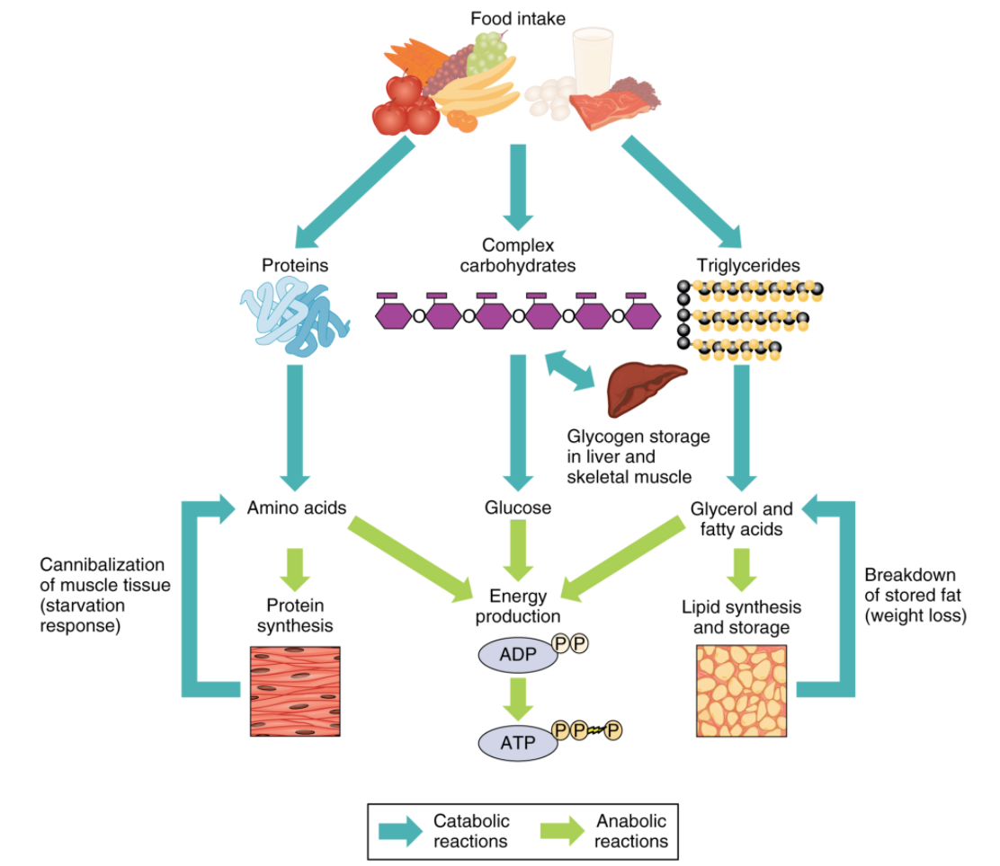

+++
date = '2025-03-17T20:41:21+05:30'
draft = false
title = "A Few Things About Macronutrients"
categories = ['Health']
+++

In this post, I continue the exploration from the [past post](/p/your-body-is-mostly-just-a-big-battery/),
where I was trying to learn a bit more about the human body
from the very basics.

## MacroNutrients, Et Cetera
First, we take in food - as solids/liquids.

And that food is broken down into different macronutrients (and other components): 

- proteins: body-building nutrients, found in meat, eggs, beans
- carbohydrates: sugars & starches, found in bread, rice, pasta
- triglycerides: fats - found in oils, butter, fatty foods

Most of the generally consumed food items have different proportions of the 3 macro nutrients - proteins, carbohydrates, triglycerides.

| **Food**                                 | **Protein (%)** | **Carbohydrates (%)** | **Triglycerides (Fats) (%)** | **Other (Water, Fiber, Vitamins, Minerals etc.) (%)** |
| ---------------------------------------- | --------------- | --------------------- | ---------------------------- | ----------------------------------------------------- |
| **Bread (white)**                        | 8–9%            | 45–50%                | 3–4%                         | 37–44%                                                |
| **Rice (cooked, white)**                 | 2–3%            | 28–30%                | 0.3%                         | 67–70%                                                |
| **Pasta (cooked)**                       | 5–6%            | 25–30%                | 1–2%                         | 62–69%                                                |
| **Meat (chicken breast, cooked)**        | 30–32%          | 0%                    | 3–4%                         | 64–67%                                                |
| **Eggs**                                 | 12–13%          | 1–2%                  | 10–11%                       | 74–77%                                                |
| **Beans (cooked, kidney beans)**         | 8–9%            | 22–25%                | 0.5–1%                       | 65–70%                                                |
| **Fruits (e.g., apple, banana)**         | 0.5–1%          | 10–15%                | 0.1–0.5%                     | 84–89%                                                |
| **Vegetables (e.g., carrots, broccoli)** | 1–3%            | 5–10%                 | 0.1–0.5%                     | 86–94%                                                |
| **Milk (whole)**                         | 3–4%            | 4–5%                  | 3–4%                         | 87–90%                                                |
| **Cheese (cheddar)**                     | 25%             | 2–3%                  | 33–35%                       | 37–40%                                                |
| **Butter**                               | 0.5%            | 0–1%                  | 80–82%                       | 17–19%                                                |
| **Cooking Oil (e.g., olive oil)**        | 0%              | 0%                    | 100%                         | 0%                                                    |

Some observations:
- Macronutrients are only one of the many components in the food we eat
- Water, fibers, vitamins and minerals also appear in significant amounts on many of our food items

## Some RAQs (Rarely Asked Questions) for the Curious

### How Carbohydrates and Glycogen are Connected?

Carbohydrates and glycogen are intrinsically linked in human metabolism. 

Carbohydrates, found in foods like grains, fruits, and vegetables, are broken down into glucose—a primary energy source. 

Excess glucose is converted into glycogen, a polysaccharide, for storage in the liver and skeletal muscles. 

This stored glycogen can be rapidly mobilized to maintain blood glucose levels during fasting or provide energy during physical activity. 

Thus, glycogen serves as the body's method of storing carbohydrates for future energy needs.

### How are glycogen and glycerol are different? They sound similar and so are confusing

Glycogen and glycerol, despite their similar-sounding names, are distinct substances with different structures and functions in the body.

**Glycogen**:

-   **Structure**: A highly branched polysaccharide composed of numerous glucose molecules linked together.
    
-   **Function**: Serves as the primary storage form of glucose in animals, fungi, and bacteria. It is stored mainly in the liver and muscle tissues and can be rapidly mobilized to meet energy demands.
    
    [en.wikipedia.org](https://en.wikipedia.org/wiki/Glycogen)
    

**Glycerol**:

-   **Structure**: A three-carbon molecule that is chemically similar to sugar; it can be thought of as half of a glucose molecule.
    
    [learn.genetics.utah.edu](https://learn.genetics.utah.edu/content/metabolism/gwords/)
    
-   **Function**: Acts as the backbone for triglycerides (fats) by binding with three fatty acids. During fat metabolism, triglycerides are broken down into fatty acids and glycerol, which can then be used for energy production or gluconeogenesis (the synthesis of glucose from non-carbohydrate sources).
    
    [en.wikipedia.org](https://en.wikipedia.org/wiki/Fatty_acid_metabolism)
    

In summary, while glycogen is a large, branched polymer of glucose serving as a storage form of energy, glycerol is a simple three-carbon molecule that forms the backbone of triglycerides and plays a role in lipid metabolism. Their structural differences underpin their distinct functions within the body's energy management systems.

In summary:

-   **Glycogen**: Think of "glycogen" as the body's "glucose generator." It is a large, branched molecule made up of glucose units and serves as the primary storage form of glucose in the body, mainly found in the liver and muscles.
-   **Glycerol**: Remember "glycerol" as the "lipid link." It is a simple three-carbon molecule that forms the backbone of triglycerides, the main constituents of body fat in humans and other animals.

