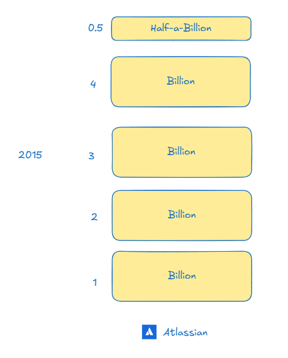
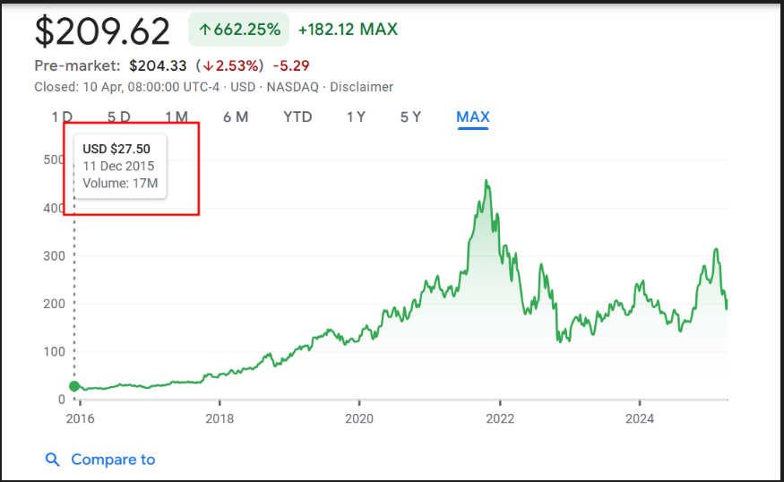
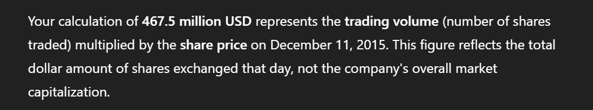
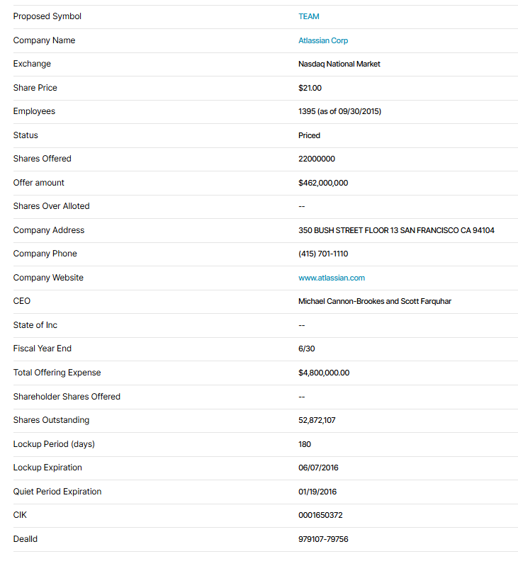
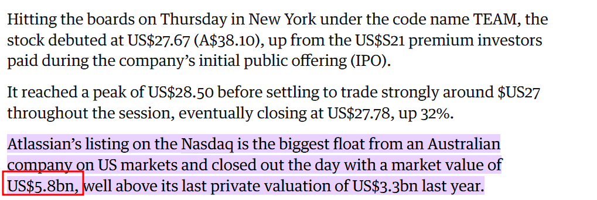

+++
date = '2025-04-10T20:41:21+05:30'
draft = false
title = "Market Capitalization"
slug = "market-capitalization"
categories = ['Micro']
+++

I was browsing some Bitbucket API documentation somewhere
when I read something like - *Atlassian IPO'd with a market
capitalization of 4.37 Billion* 

I wanted to make sense of that sentence a bit more than I
already did. 

Obvious - but worth stating for the record: Atlassian builds
Bitbucket.

Atlassian was publicly listed on NASDAQ on December 10, 2015.

The symbol for the company was the memorable word - *TEAM*

And just in case you wish to know - NASDAQ stands for:

> National Association of Securities Dealers Automated Quotations

That was a serious *WTF* moment for me.

Anyway - turns out I don't know anything about:

- Atlassian 
- NASDAQ
- Or market
- Or capitalization

But I do know one thing: 4,370,000,000 -- That's a **huge** number

Here's a visualization I drew for myself:



Then I googled for TEAM, and found its stock market history.

I went to the very beginning, Day 1. And saw this:



So I figure `28 * 17M` should give the market capitalization - but then no. That's an order of magnitude lesser than expected.

Turns out - that is merely the *trading volume* for the day; that is N number of shares were outstanding - up for the grabs - and only a percentage of that ended up getting traded:



Tried trawling for data elsewhere, different sites, different places, stil not getting the numbers I need.

Finally - in the NASDAQ site saw some relevant data:



[src](https://www.nasdaq.com/market-activity/ipos/overview?dealId=979107-79756)

Tried pluggin and chugging a few numbers - no luck.

Finally I went to the source at [SEC filing](https://www.sec.gov/Archives/edgar/data/1650372/000104746915009143/a2226831z424b4.htm) and found the following:


```
52,872,107 + 155,803,022 = 208,675,129
```

So that's the number of shares available - making up of *Class A* and *Class B* shares.

I didn't go into much details on this differrentiation - but there's voting differences, etc - which is beside the point now. Many of the data trawling sites seem to get this wrong.

Anyway - now that I know the necessary details, I could calculate market capitalization:

```
market capitalization = total number of outstanding shares x share price at close of day

market capitalization = 208,675,129 * 28 = 5,842,903,612
```

Now - that's 5.8 Billion. And that matches the news:

