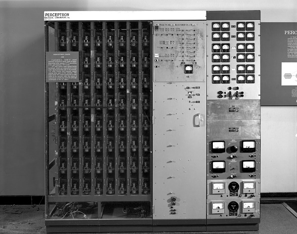
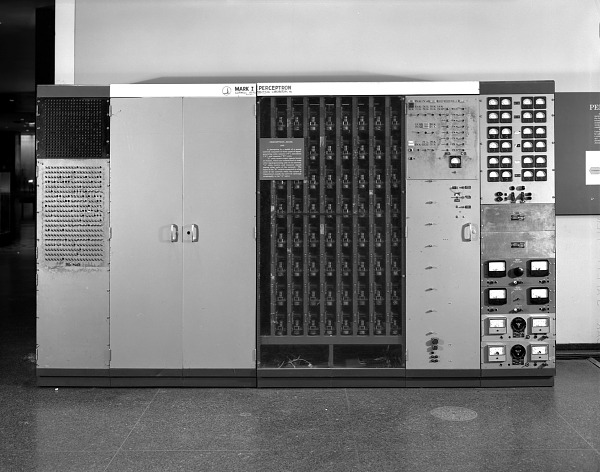
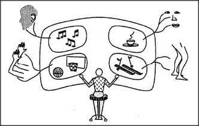
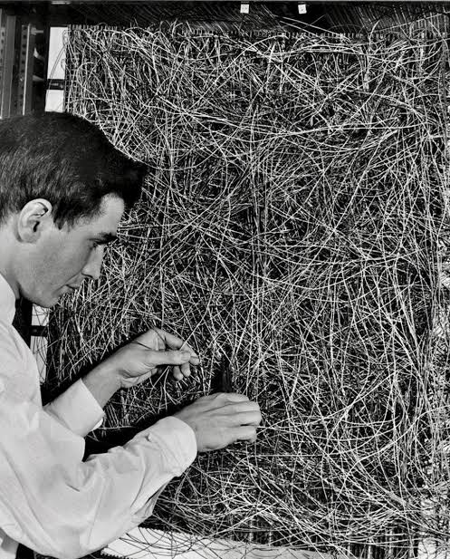
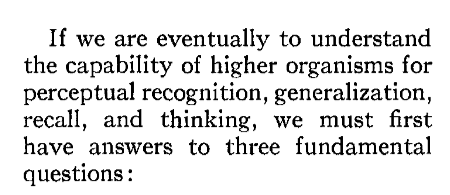
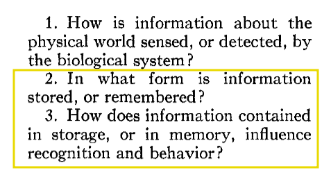

+++
date = '2025-03-09T23:41:21+05:30'
draft = false
title = "Rosenblatt's Perceptron (WIP)"
categories = ['Tech']
tags = ["ai", "history", "deeplearning"]
+++

In **Smithsonian National Museum of American History** - the following device
is visible:

[(src)](https://americanhistory.si.edu/collections/object/nmah_334414)

The device is called the **Mark I Perceptron**.

It was built in 1957.

The chief person behind construction of this device was [Frank Rosenblatt](https://en.wikipedia.org/wiki/Frank_Rosenblatt)

The device had 3 parts:

1. Stimuli receptor monitor (S)
2. Association machinery (A)
3. Response mechanism (S)

This is almost a mechanical equivalent of what Minsky sort of talks
about in his [*Society of Mind*](http://aurellem.org/society-of-mind/som-5.3.html):

> This diagram depicts our sensory machinery as sending information to the brain, wherein it is projected on some inner mental movie screen. Then, inside that ghostly theater, a lurking Self observes the scene and then considers what to do. Finally, that Self may act — somehow reversing all those steps — to influence the real world by sending various signals back through yet another family of remote-control accessories.
-- Marvin Minsky, The Society of Mind

And this is Rosenbaltt tweaking the perceptron:

You can see the [NYT](https://www.nytimes.com/1958/07/08/archives/new-navy-device-learns-by-doing-psychologist-shows-embryo-of.html) reporting that the navy claimed the device
would eventually:

> the embryo of an electronic computer today that it expects will be able to walk, talk, see, write, reproduce itself and be conscious of its existence.

All these things aside, we will try to cull some ideas from Rosenblatt's original paper - accessible at [The Perceptron: A Probabilistic Model for Information Storage and Organization in the Brain](https://www.ling.upenn.edu/courses/cogs501/Rosenblatt1958.pdf)

## Memory is the foundation for higher-level capabilities

## The 3 Questions (And R's Area of Focus)

## How is Stimulus represented in Storage?

R considers options on how storage may work - based on existing scholarship. The interesting scholarly decision happens right here - he picks the right architecture, the right bet so to speak.

### The Critical Insight: R Makes a Bet

Position A: Coded Representational Memory (Essentially - expecting an isolated storage of memory)

> The first suggests that storage of sensory information is in the form of coded representations or images, with some sort of one-to-one mapping between the sensory stimulus and the stored pattern. According to this hypothesis, if one understood the code or 'wiring diagram' of the nervous system, one should, in principle, be able to discover exactly what an organism remembers by reconstructing the original sensory patterns from the 'memory traces' which they have left, much as we might develop a photographic negative, or translate the pattern of electrical charges in the 'memory' of a digital computer.

Position B: Connectionist Memory

> The alternative approach, which stems from the tradition of British empiricism, hazards the guess that the images of stimuli may never really be recorded at all, and that the central nervous system simply acts as an intricate switching network, where retention takes the form of new connections, or pathways, between centers of activity. In many of the more recent developments of this position (Hebb's 'cell assembly,' and Hull's 'cortical anticipatory goal response,' for example) the 'responses' which are associated to stimuli may be entirely contained within the CNS itself. In this case, the response represents an 'idea' rather than an action.

Essentially - the difference in position is about direct recording vs indirect "impressions". 

### Rosenblatt's Rationale for Selecting a Connectionist Model (over Coded Representation)

- **Biology:** Coded representation is *precise*, *definite*, and **rigid** -- almost machine-like. Rosenblatt appreciated that different organisms remember things differently - learning from the same source! These individual variations in storage encouraged him to reject coded representation
- **Simplicity:** Of the options available, the connectionist model is simpler and economical. So he favored such a model.
- **Probabilistic Pattern Matching:** Rosenblatt noticed that humans and other creatures can match and work with images in diferent configurations, lighting, etc. That means - we are able to generalize the detection of objects upto an extent, classify them, and so on. He expected a more flexible model, rather than a rigid model to be able to perform this sort of work.
- **Recall is natural and direct in connectionist model:** In the coded method - learning or retrieving information requires a special lookup process. In connectionist model, learning is merely response pathway, given a stimulus. A simpler model to get the same function.
- **Stronger Mathematical Basis:** R embraced probabilistic models over deterministic ones from earlier (such as McCulloh-Pitts). He demonstrates how a random configuration of connections is able to achieve recognition (or learning).
- **Less Idealized, More biological model:** He critiques earlier models - from McCulloh and Minsky - calling them too structured or algorithmic, whereas biological learning is **stochastic**. Connectionism better aligns with real-world learning.

In short - R betted on **adaptive learning** over **rigid storage**. 

*R shows that learning and memory are not different things - the connectionist model as a simpler model - collapses storage and learning into one!*