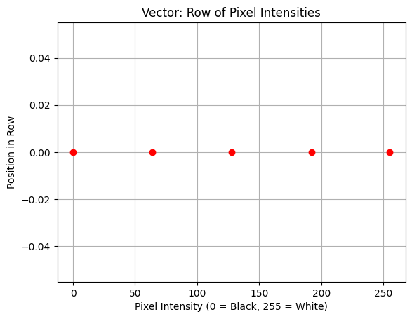
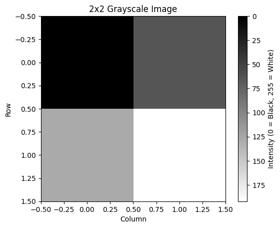
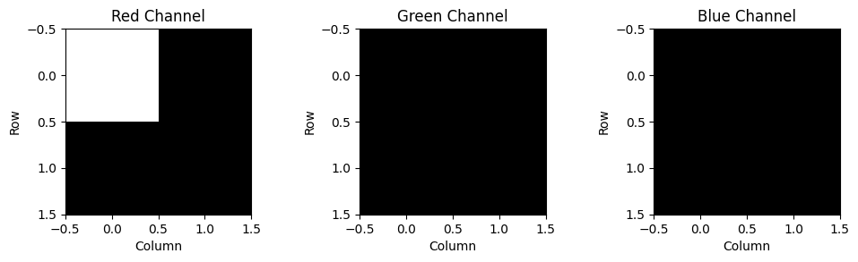
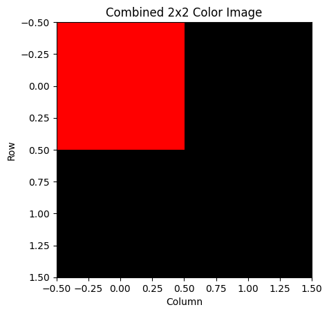
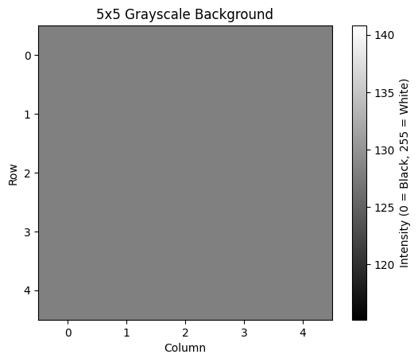
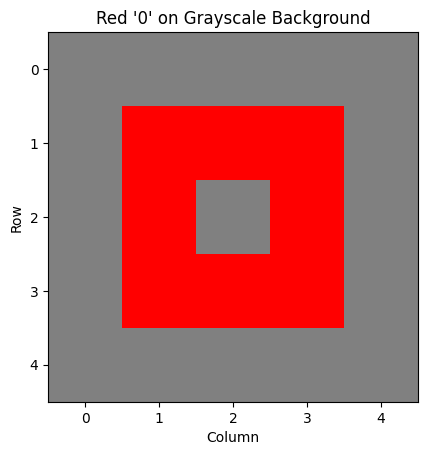

+++
date = '2025-02-28T23:11:51+05:30'
draft = false
title = 'Making A Simple Image With Tensors (Starting from Scratch)'
slug = 'tensors-challenge'
categories = ['tech']
tags = ['machine learning', 'deep learning', 'ai', 'python']
+++

---


_Hi there! I'm Shrijith Venkatrama, founder of Hexmos. Right now, I’m building [LiveAPI](https://hexmos.com/liveapi), a tool that makes generating API docs from your code ridiculously easy._


---

**Tensors** are a fundamental concept in machine learning and deep learning.

In this tutorial, we will explore tensors in a fun and light-hearted way to gain some familiarity

## What  is a Tensor?

A tensor is a multi-dimensional array that generalizes familiar concepts:

- **Scalar:** A single number (0D tensor).
- **Vector:** A list of numbers (1D tensor).
- **Matrix:** A grid of numbers (2D tensor).
- **Higher-dimensional tensors:** Structures with 3 or more dimensions (e.g., 3D, 4D).

Think of tensors as containers for organizing data in multiple dimensions, like stacking grids or cubes.

## The Challenge: Draw a Red "0" on Grey Background using Tensors

To start with, we are going to set a fairly simple goal.

We will learn a bit about tensors and then try to draw a red "0" on a grey background using the new knowledge we acquire.

For our goal:

- **Grayscale** = 2D tensor (intensity values).
- **Color (red "0")** = 3D tensor (RGB).

## Scalars - Single Pixels

A scalar is one number, like a pixel’s intensity.

```python
scalar = 128  # Medium gray
print("Scalar (Pixel Intensity):", scalar)
```

- 128 is medium gray (0 = black, 255 = white).
- This is a 0D tensor, the simplest building block.

## Vectors - Rows of Pixels

A vector (1D tensor) is a sequence of numbers, like a row of pixels.

```python
vector = [0, 64, 128, 192, 255]
print("Vector (Row of Pixels):", vector)

import matplotlib.pyplot as plt
plt.plot(vector, [0]*len(vector), 'ro')
plt.title("Vector: Row of Pixel Intensities")
plt.xlabel("Pixel Intensity (0 = Black, 255 = White)")
plt.ylabel("Position in Row")
plt.grid(True)
plt.show()
```



In this image - you can see the pixel intensity going from 0 to 255. 

0 means - black, and 255 means white, and anything in between is a shade of grey.

## Matrices - Grayscale Images

A matrix (2D tensor) is a grid of numbers, like a grayscale image.

```python
matrix = [[0, 64], [128, 192]]
print("Matrix (Grayscale Image):", matrix)

plt.imshow(matrix, cmap='gray')
plt.title("2x2 Grayscale Image")
plt.xlabel("Column")
plt.ylabel("Row")
plt.colorbar(label="Intensity (0 = Black, 255 = White)")
plt.show()
```



- Each cell in this matrix represents a pixel's intensity.
- The colorbar shows the intensity values.

## 3D Tensors - Adding Color

A 3D tensor has three 2D matrices for RGB channels.

```python
red_channel = [[255, 0], [0, 0]]  # Red in top-left
green_channel = [[0, 0], [0, 0]]
blue_channel = [[0, 0], [0, 0]]
color_image = [red_channel, green_channel, blue_channel]

print("Color Image (RGB Channels):", color_image)

fig, axs = plt.subplots(1, 3, figsize=(10, 3))
for i, (channel, color) in enumerate(zip(color_image, ['Red', 'Green', 'Blue'])):
    axs[i].imshow(channel, cmap='gray')
    axs[i].set_title(f"{color} Channel")
    axs[i].set_xlabel("Column")
    axs[i].set_ylabel("Row")
plt.tight_layout()
plt.show()
```



Visualization:
- Three subplots: RGB channels.
- Red Channel: 255 at top-left (white); others 0 (black).
- Green/Blue: All 0.

Explanation:
- 3x2x2 tensor where only red is active.

## Combining Channels

Combine RGB channels into a color image.

```python
import numpy as np
color_image_array = np.stack(color_image, axis=2)

plt.imshow(color_image_array)
plt.title("Combined 2x2 Color Image")
plt.xlabel("Column")
plt.ylabel("Row")
plt.show()
```



Visualization:

- Image: Red top-left, black elsewhere.
- Axes: 2x2 grid.

Explanation:

- RGB = (255, 0, 0) is red; (0, 0, 0) is black

## Grayscale Background

Create a 5x5 grayscale background.

```python
background = [[128 for _ in range(5)] for _ in range(5)]
print("Grayscale Background:", background)

plt.imshow(background, cmap='gray')
plt.title("5x5 Grayscale Background")
plt.xlabel("Column")
plt.ylabel("Row")
plt.colorbar(label="Intensity (0 = Black, 255 = White)")
plt.show()
```



Visualization:

- Uniform gray: All 128.
- Axes: 5x5 grid.

Explanation:

- A 2D tensor for a medium gray background.

## Drawing a Red "0"

Now, draw a red "0" on the 5x5 background using a 3D tensor. We’ll define "0" as a small oval.

```python
# Define "0" as an oval in 5x5 grid
zero_positions = [(1,1), (1,2), (1,3), (2,1), (2,3), (3,1), (3,2), (3,3)]  # Oval shape

# Initialize 5x5 RGB channels
red_channel = [[0 for _ in range(5)] for _ in range(5)]
green_channel = [[0 for _ in range(5)] for _ in range(5)]
blue_channel = [[0 for _ in range(5)] for _ in range(5)]

# Set red "0" pixels
for pos in zero_positions:
    red_channel[pos[0]][pos[1]] = 255

# Set grayscale background (RGB = 128, 128, 128)
for i in range(5):
    for j in range(5):
        if (i, j) not in zero_positions:
            red_channel[i][j] = 128
            green_channel[i][j] = 128
            blue_channel[i][j] = 128

# Combine into 3D tensor
color_image = [red_channel, green_channel, blue_channel]
color_image_array = np.stack(color_image, axis=2)

# Visualize
plt.imshow(color_image_array)
plt.title("Red '0' on Grayscale Background")
plt.xlabel("Column")
plt.ylabel("Row")
plt.show()
```



### Visualization:

-   **Image**: A red oval "0" on gray.
-   **Red pixels**: RGB = (255, 0, 0) at zero\_positions.
-   **Gray background**: RGB = (128, 128, 128) elsewhere.
-   **Axes**: 5x5 grid.

### Explanation:

-   **New zero\_positions**: Forms a rough oval:
    -   Top: (1,1), (1,2), (1,3)
    -   Sides: (2,1), (2,3)
    -   Bottom: (3,1), (3,2), (3,3)
-   This 5x5x3 tensor places red where the "0" is and gray everywhere else.

## Conclusion

So - that's it. 

We progressed from:

-   **Scalars**: Pixel intensities.
-   **Vectors**: Rows of pixels.
-   **Matrices**: Grayscale images.
-   **3D Tensors**: Color images.

At each step, we visualized the data to understand its structure and content.

Hope this gave you a good intuition about tensors!