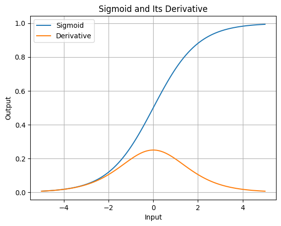
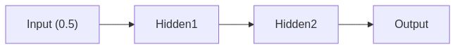
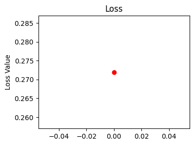
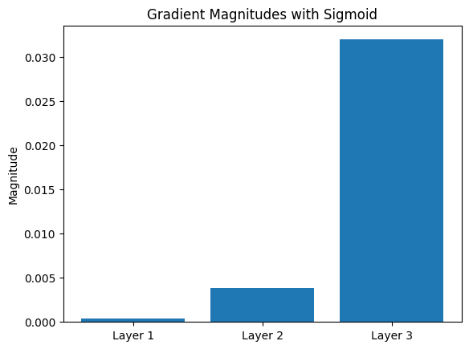
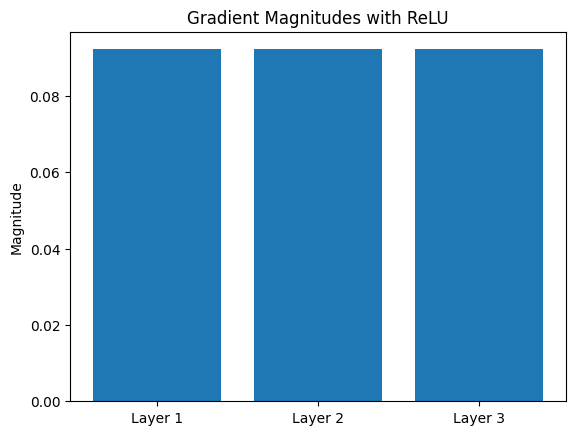

+++
date = '2025-03-01T22:46:54+05:30'
draft = false
title = 'A Friendly Step-by-Step Tutorial on the Vanishing Gradient Problem'
categories = ['Tech']
tags = ['machine learning', 'deep learning', 'ai', 'python']
math = true
+++


---


_Hi there! I'm Shrijith Venkatrama, founder of Hexmos. Right now, I’m building [LiveAPI](https://hexmos.com/liveapi), a tool that makes generating API docs from your code ridiculously easy._


---

In this hands-on tutorial, we’re going to explore the vanishing gradient problem in deep neural networks—a tricky issue that can slow down or even stop learning in early layers. 

You can run the sample code in a Jupyter Notebook, see diagrams, and have those "aha!" moments as we go. 

We’ll use Python with NumPy (and a touch of PyTorch later) to keep things clear and practical. 

By the end, you’ll also see how the ReLU activation function can save the day!

Let’s dive in, step by step, with bite-sized code snippets and plenty of explanations then.

## Setting Up Your Environment

First, let’s get our tools ready. We’ll use NumPy for calculations and Matplotlib for visualizations. Open a Jupyter Notebook and run this:

```python
import numpy as np
import matplotlib.pyplot as plt
```

Now, let’s define the **sigmoid activation function** and its derivative, since they’re central to understanding the vanishing gradient problem.

```python
def sigmoid(x):
    return 1 / (1 + np.exp(-x))

def sigmoid_derivative(x):
    return sigmoid(x) * (1 - sigmoid(x))
```

**What’s Happening?**

-   The sigmoid function squashes any input into a range between 0 and 1.
-   Its derivative (which we’ll use in backpropagation) is always small—its maximum value is 0.25. This tiny derivative is a big clue to why gradients vanish!

Let’s visualize sigmoid and its derivative to get a feel for them:

```python
x = np.linspace(-5, 5, 100)
plt.plot(x, sigmoid(x), label='Sigmoid')
plt.plot(x, sigmoid_derivative(x), label='Derivative')
plt.legend()
plt.title('Sigmoid and Its Derivative')
plt.xlabel('Input')
plt.ylabel('Output')
plt.grid(True)
plt.show()
```



**Aha Moment**:  

Notice how the derivative peaks at 0.25 and drops to near 0 for large positive or negative inputs. When we multiply these small values across layers, gradients can shrink fast.

## Building a Tiny Neural Network

Let’s create a simple network with:

-   1 input neuron (value = 0.5)
-   2 hidden layers (1 neuron each)
-   1 output neuron (target = 0.8)

We’ll set all weights to 0.5 and biases to 0 for simplicity.

```python
# Input and target
input_data = np.array([[0.5]])
target_output = np.array([[0.8]])

# Weights and biases
weights1 = np.array([[0.5]])  # Input to Hidden Layer 1
bias1 = np.array([[0]])
weights2 = np.array([[0.5]])  # Hidden Layer 1 to Hidden Layer 2
bias2 = np.array([[0]])
weights3 = np.array([[0.5]])  # Hidden Layer 2 to Output
bias3 = np.array([[0]])
```



Each arrow has a weight of 0.5, and each neuron uses the sigmoid function

## Forward Pass—Making a Prediction

Let’s compute the output step by step. Run each line and see how the signal flows:

```python
# Hidden Layer 1
layer1_input = np.dot(weights1, input_data) + bias1  # 0.5 * 0.5 + 0 = 0.25
layer1_output = sigmoid(layer1_input)  # ≈ 0.562

# Hidden Layer 2
layer2_input = np.dot(weights2, layer1_output) + bias2  # 0.5 * 0.562 ≈ 0.281
layer2_output = sigmoid(layer2_input)  # ≈ 0.570

# Output Layer
output_input = np.dot(weights3, layer2_output) + bias3  # 0.5 * 0.570 ≈ 0.285
output = sigmoid(output_input)  # ≈ 0.571

print(f"Predicted Output: {output[0][0]:.3f}, Target: {target_output[0][0]}")
```

**Aha Moment**:  
Our prediction (≈ 0.571) is way off the target (0.8). We need to adjust the weights, but that depends on gradients. Let’s see if they’re strong enough to help!


## Compute the Loss

Let’s measure how bad our prediction is using mean squared error:

```python
loss = 0.5 * np.power(output - target_output, 2)
print(f"Loss: {loss[0][0]:.3f}")
```

Plot the loss:

```python
plt.figure(figsize=(4, 3))
plt.plot([0], [loss], 'ro')
plt.title('Loss')
plt.ylabel('Loss Value')
plt.show()
```




**What’s Happening?**  

The loss (≈ 0.026) shows our error. Backpropagation will use gradients to reduce this, but let’s see if those gradients hold up.

## Backward Pass - Where Gradients Vanish

Now, we’ll calculate gradients starting from the output and moving backward. This is where the vanishing gradient problem shows up!

```python
# Output Layer Gradients
d_loss_d_output = output - target_output  # ≈ -0.229
d_loss_d_output_input = d_loss_d_output * sigmoid_derivative(output_input)  # ≈ -0.056
gradient_weights3 = d_loss_d_output_input * layer2_output  # ≈ -0.032

# Hidden Layer 2 Gradients
error_layer2 = np.dot(weights3.T, d_loss_d_output_input)  # ≈ -0.028
d_loss_d_layer2_input = error_layer2 * sigmoid_derivative(layer2_input)  # ≈ -0.007
gradient_weights2 = d_loss_d_layer2_input * layer1_output  # ≈ -0.004

# Hideen Layer 1 Gradients

error_layer1 = np.dot(weights2.T, d_loss_d_layer2_input)  # ≈ -0.0035
d_loss_d_layer1_input = error_layer1 * sigmoid_derivative(layer1_input)  # ≈ -0.00085
gradient_weights1 = d_loss_d_layer1_input * input_data  # ≈ -0.000425
```

**Aha Moment**:  
Look at the gradient sizes:

-   Output layer: ≈ -0.032
-   Hidden Layer 2: ≈ -0.004
-   Hidden Layer 1: ≈ -0.000425

They’re shrinking fast! Let’s plot them:


```python
gradients = [abs(gradient_weights1[0][0]), abs(gradient_weights2[0][0]), abs(gradient_weights3[0][0])]
layers = ['Layer 1', 'Layer 2', 'Layer 3']
plt.bar(layers, gradients)
plt.title('Gradient Magnitudes with Sigmoid')
plt.ylabel('Magnitude')
plt.show()
```



**Insight**:  
The deeper we go (toward Layer 1), the tinier the gradients get. This is the vanishing gradient problem—early layers barely learn because their updates are so small!

## Why Do Gradients Vanish?

Here’s the key: each gradient is multiplied by the sigmoid derivative (max 0.25). Across layers, it’s like:

-   Layer 3: gradient
-   Layer 2: gradient × <0.25
-   Layer 1: gradient × <0.25 × <0.25

**Intuition**:  
Imagine passing a message through a chain of people, each whispering quieter. By the time it reaches the start, it’s almost silent. That’s what’s happening to our gradients!

## How ReLU Solves the Vanishing Gradient Problem

Let’s switch to **ReLU** (Rectified Linear Unit), defined as:

$$ReLU(x) = max⁡(0,x)$$

with a derivative of 1 for $x>0$. This doesn’t shrink gradients! Let’s define it:

```python
def relu(x):
    return np.maximum(0, x)

def relu_derivative(x):
    return np.where(x > 0, 1, 0)
```

### ReLU Forward Pass

Redo the forward pass with ReLU:

```python
layer1_input = np.dot(weights1, input_data) + bias1  # 0.25
layer1_output = relu(layer1_input)  # 0.25 (since 0.25 > 0)

layer2_input = np.dot(weights2, layer1_output) + bias2  # 0.5 * 0.25 = 0.125
layer2_output = relu(layer2_input)  # 0.125

output_input = np.dot(weights3, layer2_output) + bias3  # 0.5 * 0.125 = 0.0625
output = relu(output_input)  # 0.0625

print(f"ReLU Output: {output[0][0]:.4f}")
```

**Note**:  
For simplicity, we used ReLU everywhere. In practice, the output layer might be linear for regression, but this shows the idea.

### ReLU Backward Pass

Now, compute gradients:


```python
d_loss_d_output = output - target_output  # 0.0625 - 0.8 ≈ -0.7375
d_loss_d_output_input = d_loss_d_output * relu_derivative(output_input)  # -0.7375 * 1 = -0.7375
gradient_weights3 = d_loss_d_output_input * layer2_output  # ≈ -0.0922

error_layer2 = np.dot(weights3.T, d_loss_d_output_input)  # ≈ -0.36875
d_loss_d_layer2_input = error_layer2 * relu_derivative(layer2_input)  # ≈ -0.36875
gradient_weights2 = d_loss_d_layer2_input * layer1_output  # ≈ -0.0922

error_layer1 = np.dot(weights2.T, d_loss_d_layer2_input)  # ≈ -0.184375
d_loss_d_layer1_input = error_layer1 * relu_derivative(layer1_input)  # ≈ -0.184375
gradient_weights1 = d_loss_d_layer1_input * input_data  # ≈ -0.0922
```

**Aha Moment**:  
Check the gradients:

-   Layer 3: ≈ -0.0922
-   Layer 2: ≈ -0.0922
-   Layer 1: ≈ -0.0922

They’re all the same size! Plot them:


```python
gradients_relu = [abs(gradient_weights1[0][0]), abs(gradient_weights2[0][0]), abs(gradient_weights3[0][0])]
plt.bar(layers, gradients_relu)
plt.title('Gradient Magnitudes with ReLU')
plt.ylabel('Magnitude')
plt.show()
```



**Insight**:  
ReLU’s derivative of 1 (for positive inputs) keeps gradients strong, so early layers can learn just as well as later ones. No vanishing here!

## Bonus: Trying it With PyTorch

Let’s quickly see this with PyTorch for a modern twist. Install PyTorch if you haven’t (pip install torch), then run:

```python
import torch

# Define inputs and weights as tensors with gradients
x = torch.tensor([[0.5]], requires_grad=False)
target = torch.tensor([[0.8]])
w1 = torch.tensor([[0.5]], requires_grad=True)
w2 = torch.tensor([[0.5]], requires_grad=True)
w3 = torch.tensor([[0.5]], requires_grad=True)

# Forward pass with sigmoid
h1 = torch.sigmoid(w1 @ x)
h2 = torch.sigmoid(w2 @ h1)
out = torch.sigmoid(w3 @ h2)

# Loss
loss = 0.5 * (out - target) ** 2
loss.backward()

# Print gradients
print(f"Gradient w1: {w1.grad.item():.6f}")
print(f"Gradient w2: {w2.grad.item():.6f}")
print(f"Gradient w3: {w3.grad.item():.6f}")
```

**Output**:  

```
Gradient w1: -0.000424
Gradient w2: -0.003870
Gradient w3: -0.032004
```

You’ll see gradients shrinking from w3 to w1, just like before. Now try ReLU:


```python
# Reset gradients
w1.grad = None
w2.grad = None
w3.grad = None

# Forward pass with ReLU
h1 = torch.relu(w1 @ x)
h2 = torch.relu(w2 @ h1)
out = torch.relu(w3 @ h2)

# Loss and backward
loss = 0.5 * (out - target) ** 2
loss.backward()

print(f"ReLU Gradient w1: {w1.grad.item():.6f}")
print(f"ReLU Gradient w2: {w2.grad.item():.6f}")
print(f"ReLU Gradient w3: {w3.grad.item():.6f}")
```
Output:

```
ReLU Gradient w1: -0.092188
ReLU Gradient w2: -0.092188
ReLU Gradient w3: -0.092188
```

**Aha Moment**:  
PyTorch confirms it—ReLU keeps gradients steady, while sigmoid lets them vanish.

## Conclusion

You’ve just walked through the vanishing gradient problem.

With sigmoid, gradients shrink exponentially in deeper layers, slowing learning. 

ReLU fixes this by keeping gradients robust. 

Try tweaking the network—add layers or change weights—and watch how gradients behave. 

You’ve got the tools and intuition now—happy experimenting!

